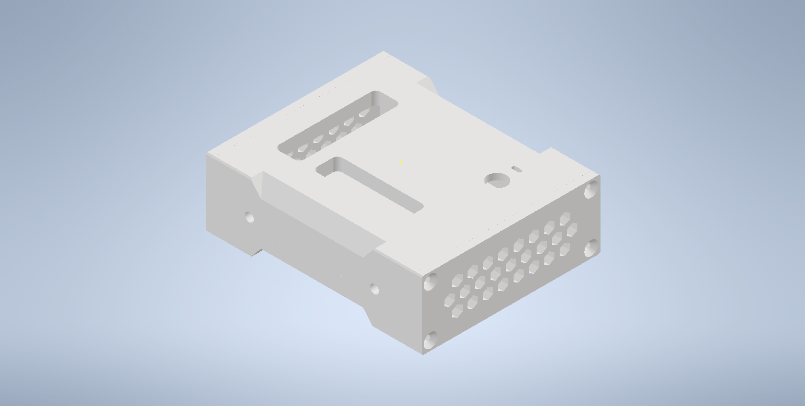
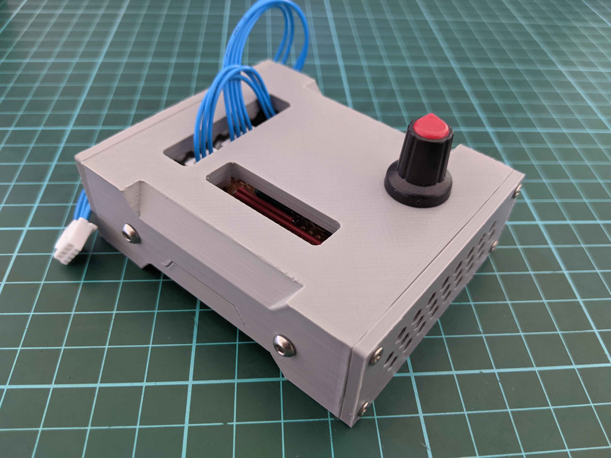

# Simple Differential Generator

<table>
    <tr>
        <td>
            <b>Inventor (2022)</b>
        </td>
    </tr>
    <tr>
        <td>
            
        </td>
    </tr>
</table>
<table>
    <tr>
        <td>
            <b>Assembly</b>
        </td>
    </tr>
    <tr>
        <td>
            
        </td>
    </tr>
</table>
<table>
    <tr>
        <td>
            <b>Circuit</b>
        </td>
    </tr>
    <tr>
        <td>
            
        </td>
    </tr>
</table>

## About

This simple circuit converts a 5V input signal to a 12mV differential signal with a common mode of
2V. The purpose of the circuit was to mimic the behavior of a strain gauge for testing.

Additionally, there a 2 LED's to indicate the polarity of the - and + outputs. In terms of a strain
gauge, this corresponds to the zero-point (both on), tension (green) and compression (red).

## Improvements

-   Low-pass filters could have been used on the voltage followers.

## Notes

-   The swing of the op-amp is Vcc - 1.5 and therefore the 5V range of the potentiometer can not be
    followed by the op-amp. Values are clipped at around 3.5V when probed by the oscilloscope.
